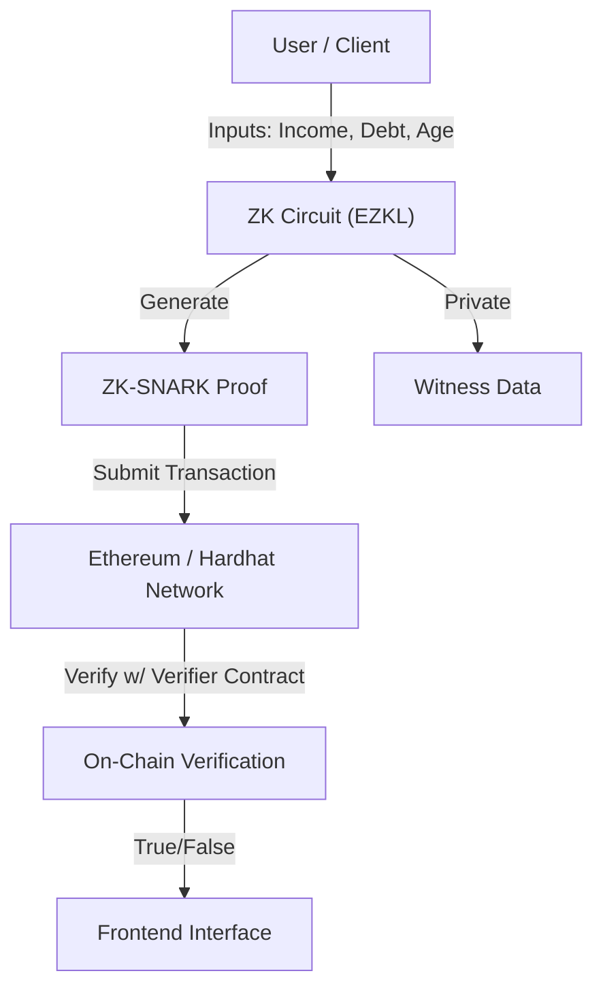

# VeriCred - Privacy-Preserving Zero-Knowledge Credit Scoring


**VeriCred** is a decentralized, privacy-first application that enables users to generate verifiable cryptographic proofs of their creditworthiness using **Zero-Knowledge Machine Learning (ZKML)**. By leveraging **EZKL** and **Halo2**, users can prove they meet credit requirements without ever revealing their sensitive financial data (income, debt, age) to the verifier or the blockchain.

## 🌟 Key Innovations

*   **Zero-Knowledge Privacy**: Financial data remains strictly on the client-side/local environment. Only the *proof* of computation forms the transaction.
*   **Trustless Verification**: The **Halo2Verifier** smart contract on Ethereum (Sepolia/Localhost) mathematically guarantees the validity of the credit score without seeing the inputs.
*   **Tamper-Proof AI**: The credit scoring model (ONNX) is committed to the blockchain via a cryptographic commitment. Any modification to the model inputs or weights invalidates the proof.
*   **Hybrid Architecture**: seamless integration of off-chain ZK computation with on-chain verification.

## 🏗 System Architecture



## 🛠 Tech Stack

### Core ZKML
*   **EZKL**: For converting ONNX models into Halo2 circuits and managing proof generation.
*   **Halo2**: The ZK-SNARK proving system backend.
*   **PyTorch/ONNX**: For training and exporting the underlying credit scoring neural network.

### Backend & API
*   **Python**: Core logic for handling witness generation and proof orchestration.
*   **FastAPI**: High-performance API server handling client requests.
*   **SQLite**: Local storage for request history and proof logging.

### Blockchain
*   **Solidity**: `Halo2Verifier` smart contract.
*   **Hardhat**: Development environment for compiling, deploying, and testing contracts.
*   **Ethers.js**: Library for blockchain interaction.

### Frontend
*   **HTML/JS (Lite)**: Lightweight interface for rapid testing and demonstration.
*   **Next.js (In Development)**: Full-featured React application for production deployment.

## 🚀 Getting Started

Follow these steps to set up the complete environment locally.

### Prerequisites
*   **Node.js** (v18+)
*   **Python** (v3.10+)
*   **Git**

### 1. Repository Setup
```bash
git clone https://github.com/KAVYAJOSHI1/VeriCred.git
cd VeriCred
```

### 2. Backend Setup
The backend handles the heavy lifting of ZK proof generation.

```bash
# Create and activate virtual environment
python3 -m venv venv
source venv/bin/activate

# Install dependencies
pip install -r requirements.txt

# Run the backend server
python3 backend/main.py
```
*Server will start at `http://localhost:8000`*

### 3. Blockchain Setup (Local Testnet)
Deploy the verify contract to a local Hardhat node.

**Terminal 2:**
```bash
cd blockchain
npm install
npx hardhat node
```

**Terminal 3:**
```bash
cd blockchain
# Deploy the Verifier contract
npx hardhat run scripts/deploy.js --network localhost
```
*Note the deployed contract address for configuration.*

### 4. Frontend Usage
For the best testing experience, use the lightweight frontend currently integrated with the local backend.

1.  Navigate to `simple_frontend/`.
2.  Open `index.html` in your browser (or serve via `python3 -m http.server 5500`).
3.  Enter financial details (e.g., Age: 30, Income: 50000).
4.  Click **Generate Proof**.
5.  Watch as the system generates a ZK-SNARK proof and verifies it.

---

## 📂 Project Structure

*   `ai/`: Neural network training and ONNX export scripts.
*   `zk-circuit/`: EZKL artifacts, circuit settings, and SRS files.
*   `backend/`: FastAPI application and proof orchestration logic.
*   `blockchain/`: Hardhat project, Solidity contracts, and deployment scripts.
*   `simple_frontend/`: Working client interface for demonstration.
*   `frontend/`: Next.js application source code.

## 📄 License
MIT License.
